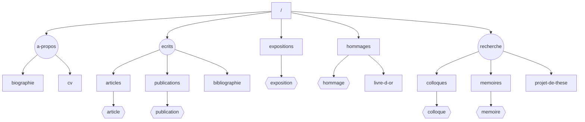

```mermaid
graph TD
    A["/"] --> B(("a-propos"))
    A --> C(("ecrits"))
    A --> D["expositions"]
    A --> E["hommages"]
    A --> F(("recherche"))

    B --> B1["biographie"]
    B --> B2["cv"]

    C --> C1["articles"]
    C --> C2["publications"]
    C --> C3["bibliographie"]
    C1 --> C1b{{"article"}}
    C2 --> C2b{{"publication"}}

    D --> D2{{"exposition"}}

    E --> E2{{"hommage"}}
    E --> E3["livre-d-or"]

    F --> F1["colloques"]
    F --> F2["memoires"]
    F --> F3["projet-de-these"]
    F1 --> F1b{{"colloque"}}
    F2 --> F2b{{"memoire"}}
```
