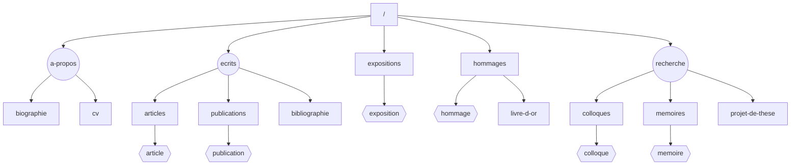

# vanessanoizet

Site personnel de Vanessa Noizet — chercheuse en histoire de l'art.

## Stack

- [Astro](https://astro.build) 5
- [Panda CSS](https://panda-css.com)
- TypeScript

## Commandes

| Commande       | Description                        |
| -------------- | ---------------------------------- |
| `pnpm install` | Installer les dépendances          |
| `pnpm dev`     | Lancer le serveur de développement |
| `pnpm build`   | Vérifier les types et build        |
| `pnpm preview` | Prévisualiser le build             |
| `pnpm format`  | Formater le code avec Prettier     |

## Structure

```
src/
├── components/        # Composants réutilisables (Button, Dropdown, Prose…)
├── features/          # Fonctionnalités (navigation desktop/mobile)
├── layouts/           # Layout principal
├── pages/             # Routes (file-based routing)
└── utils/             # Utilitaires

content/               # Collections de contenu (articles, expositions, hommages…)
styled-system/         # Sortie Panda CSS (généré, non commité)
```

## Sitemap



## Contenu

Le contenu vit dans `content/`, organisé en collections (Astro Content Collections). Chaque collection a un schéma typé défini dans `src/content.config.ts`.

Conventions générales :

- `date` au format `YYYY-MM-DD` (sert au tri).
- Champs de type texte : guillemets simples ou doubles selon présence d'apostrophes.
- `*texte*` dans une valeur = italique (rendu via `<em>`).
- Le corps Markdown (sous la deuxième ligne `---`) est utilisé seulement quand indiqué.
- Fichiers PDF à déposer dans `public/pdfs/`, référencés via `/pdfs/<fichier>.pdf`.

### `home/` — page d'accueil

Fichier unique `content/home/index.md`. Image co-localisée.

| Champ      | Type   | Requis | Rôle                            |
| ---------- | ------ | ------ | ------------------------------- |
| `image`    | image  | oui    | Portrait, optimisé par Astro    |
| `imageAlt` | string | oui    | Texte alternatif de l'image     |
| `intro`    | string | oui    | Court paragraphe d'introduction |

Le corps Markdown est rendu sous l'intro.

```yaml
---
image: ./portrait.jpeg
imageAlt: Portrait de Vanessa Noizet devant une œuvre d'archives
intro: Historienne de l'art, chercheuse en art brut et art naïf.
---

Texte d'introduction au format Markdown…
```

### `articles/` — articles publiés

Un fichier `*.md` par article. Corps Markdown rendu sur la fiche.

| Champ   | Type | Requis | Rôle                                       |
| ------- | ---- | ------ | ------------------------------------------ |
| `title` | str  | oui    | Titre                                      |
| `date`  | date | oui    | Date de publication (tri descendant)       |
| `pdf`   | str  | non    | Chemin du PDF, ex. `/pdfs/article.pdf`     |

```yaml
---
title: 'Gaston Chaissac / Anatole Jakovsky : duo, duel, trio'
date: 2015-02-01
pdf: /pdfs/chaissac-jakovsky.pdf
---

Corps de l'article…
```

### `publications/` — ouvrages, catalogues

Un fichier `*.md` par publication. Pas de corps utilisé.

| Champ       | Type   | Requis | Rôle                                                  |
| ----------- | ------ | ------ | ----------------------------------------------------- |
| `title`     | str    | oui    | Titre                                                 |
| `subtitle`  | str    | non    | Sous-titre                                            |
| `date`      | date   | oui    | Pour le tri                                           |
| `year`      | str    | oui    | Année affichée (peut différer du tri, ex. `2015`)     |
| `publisher` | str    | oui    | Éditeur, lieu                                         |
| `role`      | str    | non    | Rôle, ex. `Co-autrice`, `Direction d'ouvrage`         |
| `pages`     | str    | non    | Pagination, ex. `224 pages`                           |
| `isbn`      | str    | non    | ISBN                                                  |
| `link`      | objet  | non    | `{ url, label }` lien externe                         |

```yaml
---
title: 'Du nombril au cosmos'
subtitle: 'Autour de la collection abcd / Bruno Decharme'
date: 2015-04-30
year: '2015'
publisher: 'Art et Marges Musée, Bruxelles'
role: 'Co-autrice'
pages: '224 pages'
isbn: '978-2-930706-04-7'
link:
  url: 'https://www.artetmarges.be/'
  label: 'Art et Marges Musée'
---
```

### `bibliographie/` — liste complète des écrits

Un fichier `*.md` par entrée. Pas de corps.

| Champ      | Type | Requis | Rôle                                                                        |
| ---------- | ---- | ------ | --------------------------------------------------------------------------- |
| `title`    | str  | oui    | Référence complète                                                          |
| `year`     | str  | oui    | Année affichée                                                              |
| `date`     | date | oui    | Tri chronologique                                                           |
| `category` | enum | oui    | `these`, `memoire`, `article`, `catalogue`, `court-texte`, `compte-rendu`, `conference` |

```yaml
---
title: "« Dans l'orbite de Gaston Chaissac… »"
year: '2013'
date: 2013-01-12
category: conference
---
```

### `expositions/` — fiches expositions

Un fichier `*.md` par exposition. Corps Markdown rendu sur la fiche.

| Champ     | Type   | Requis | Rôle                                                  |
| --------- | ------ | ------ | ----------------------------------------------------- |
| `title`   | str    | oui    | Titre                                                 |
| `date`    | date   | oui    | Date de début                                         |
| `dateEnd` | date   | non    | Date de fin                                           |
| `venue`   | str    | oui    | Lieu / institution                                    |
| `city`    | str    | non    | Ville                                                 |
| `role`    | str    | non    | Rôle, ex. `Commissariat`, `Conseillère scientifique`  |
| `pdf`     | str    | non    | Dossier de presse, `/pdfs/...`                        |
| `link`    | objet  | non    | `{ url, label }`                                      |
| `cover`   | objet  | oui    | `{ src, alt }` image de couverture (URL ou chemin)    |
| `images`  | array  | non    | Galerie, voir ci-dessous                              |

`images[]` :

| Champ     | Type | Requis | Rôle                                                  |
| --------- | ---- | ------ | ----------------------------------------------------- |
| `src`     | str  | oui    | URL ou chemin, ex. `/placeholders/landscape.jpg`      |
| `alt`     | str  | oui    | Texte alternatif                                      |
| `caption` | str  | non    | Légende sous l'image                                  |
| `width`   | num  | non    | Largeur intrinsèque, sert au calcul d'aspect en grille |
| `height`  | num  | non    | Hauteur intrinsèque                                   |

Placeholders fournis dans `public/placeholders/` : `landscape-wide.jpg` (1600×1000), `landscape.jpg` (1400×1000), `portrait.jpg` (1000×1400), `portrait-tall.jpg` (1000×1600). Pour de vraies images, déposer dans `public/` puis renseigner `width`/`height`.

```yaml
---
title: 'Aloïse, écritures du dedans'
date: 2022-05-06
dateEnd: 2022-10-30
venue: "Collection de l'Art Brut"
city: 'Lausanne'
role: 'Conseillère scientifique'
link:
  url: 'https://www.artbrut.ch/'
  label: "Collection de l'Art Brut"
cover:
  src: '/placeholders/landscape.jpg'
  alt: 'Polyptyque coloré, fond bleu intense'
images:
  - src: '/placeholders/portrait-tall.jpg'
    width: 1000
    height: 1600
    alt: 'Figure féminine au regard de cobalt'
    caption: '*Cléopâtre au bain*, vers 1947.'
---

Corps Markdown décrivant l'exposition…
```

### `hommages/` — hommages reçus

Un fichier `*.md` par hommage. Corps Markdown rendu.

| Champ   | Type | Requis | Rôle                       |
| ------- | ---- | ------ | -------------------------- |
| `title` | str  | oui    | Titre                      |
| `date`  | date | oui    | Date (tri)                 |
| `pdf`   | str  | non    | PDF associé, `/pdfs/...`   |

### `livredor/` — entrées du livre d'or

Un fichier `*.md` par entrée. Corps Markdown rendu.

| Champ   | Type | Requis | Rôle                |
| ------- | ---- | ------ | ------------------- |
| `title` | str  | oui    | Auteur ou intitulé  |
| `date`  | date | oui    | Date                |

### `colloques/` — interventions en colloque

Un fichier `*.md` par colloque. Corps Markdown rendu.

| Champ   | Type | Requis | Rôle  |
| ------- | ---- | ------ | ----- |
| `title` | str  | oui    | Titre |
| `date`  | date | oui    | Date  |

### `memoires/` — mémoires

Même schéma que `colloques`. Le dossier `content/memoires/` est à créer pour ajouter des entrées.

### `biographie/` — page Biographie

Fichier unique `content/biographie/index.md`. Corps Markdown rendu entre le lead et les listes.

| Champ           | Type    | Requis | Rôle                                                         |
| --------------- | ------- | ------ | ------------------------------------------------------------ |
| `birthDate`     | date    | oui    | Date de naissance                                            |
| `birthPlace`    | str     | oui    | Lieu de naissance                                            |
| `deathDate`     | date    | oui    | Date de décès                                                |
| `deathPlace`    | str     | oui    | Lieu de décès                                                |
| `lead`          | str     | oui    | Phrase d'introduction (italique implicite, `*mot*` accepté)  |
| `enseignements` | array   | oui    | Liste `{ years, body }`                                      |
| `bourses`       | array   | oui    | Liste `{ years, body }`                                      |

```yaml
---
birthDate: 1986-05-22
birthPlace: Vannes
deathDate: 2021-04-19
deathPlace: Paris
lead: |
  Vanessa Noizet, historienne de l'art française. Travaux sur la réception de l'œuvre de *Gaston Chaissac*.
enseignements:
  - years: '2019'
    body: 'Université Paris 8, Vincennes. Cours magistraux et TD (XXᵉ siècle).'
bourses:
  - years: '2019'
    body: "Bourse d'édition, Institut Giacometti."
---
```

### `cv/` — page CV

Fichier unique `content/cv/index.md`. Pas de corps.

| Champ      | Type  | Requis | Rôle                                                       |
| ---------- | ----- | ------ | ---------------------------------------------------------- |
| `pdf`      | str   | non    | PDF du CV téléchargeable                                   |
| `sections` | array | oui    | Sections : `{ heading, entries: [{ years, body }] }`       |

```yaml
---
pdf: /pdfs/cv-vanessa-noizet.pdf
sections:
  - heading: Formation
    entries:
      - years: '2014, 2021'
        body: "Doctorat en histoire de l'art, université Paris I."
  - heading: Recherche
    entries:
      - years: '2019, 2021'
        body: 'Chargée de recherche associée.'
---
```

### `dessins/` — galerie de dessins (page À propos)

Un fichier `*.md` par dessin, image co-localisée. Pas de corps. Images optimisées en `webp` automatiquement par Astro.

| Champ     | Type  | Requis | Rôle                                              |
| --------- | ----- | ------ | ------------------------------------------------- |
| `image`   | image | oui    | Chemin relatif vers le fichier (`./dessin-01.jpg`) |
| `caption` | str   | non    | Légende affichée sous l'image                     |
| `order`   | num   | non    | Tri ascendant (à défaut, ordre alphabétique du fichier) |

```yaml
---
image: ./dessin-01.jpg
caption: 'Portrait au journal, vers 2005. Fusain et collage.'
order: 1
---
```

## Médias

| Dossier              | Contenu                                                                  |
| -------------------- | ------------------------------------------------------------------------ |
| `public/pdfs/`       | PDF référencés par les collections (articles, hommages, expositions, cv) |
| `public/placeholders/` | Images de remplissage pour expositions (4 tailles fournies)            |
| `public/favicon.svg` | Favicon                                                                  |
| `content/<col>/*.jpg` ou `.jpeg` | Images co-localisées des collections `home` et `dessins`     |
