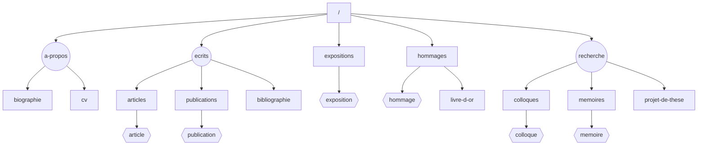

# vanessanoizet

Site personnel de Vanessa Noizet — chercheuse en histoire de l'art.

## Stack

- [Astro](https://astro.build) 5
- [Panda CSS](https://panda-css.com)
- TypeScript

## Commandes

| Commande       | Description                        |
| -------------- | ---------------------------------- |
| `pnpm install` | Installer les dépendances          |
| `pnpm dev`     | Lancer le serveur de développement |
| `pnpm build`   | Vérifier les types et build        |
| `pnpm preview` | Prévisualiser le build             |
| `pnpm format`  | Formater le code avec Prettier     |

## Structure

```
src/
├── components/        # Composants réutilisables (Button, Dropdown, Prose…)
├── features/          # Fonctionnalités (navigation desktop/mobile)
├── layouts/           # Layout principal
├── pages/             # Routes (file-based routing)
└── utils/             # Utilitaires

content/               # Collections de contenu (articles, expositions, hommages…)
styled-system/         # Sortie Panda CSS (généré, non commité)
```

## Sitemap


